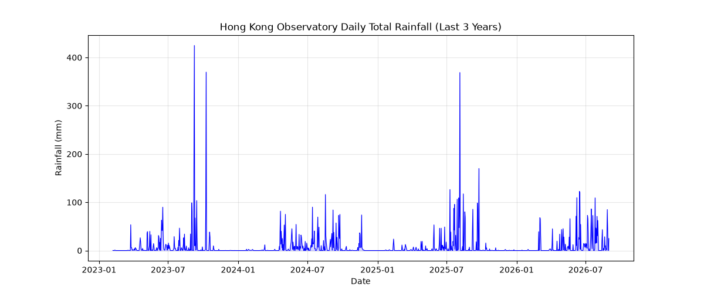

# Hong Kong Rainfall Visualisation (1884–2026)

## What is this?
This repository visualises daily total rainfall data from the Hong Kong Observatory, covering over 140 years of records. The data was downloaded from the Hong Kong Government's open data portal.

## How to run
1. Fetch the raw data:
   `uv run fetch.py`
2. Preview the data structure:
   `python3 preview.py`
3. Generate the plot:
   `python3 plot.py`

## The picture

## What does it show?
The plot shows the daily total rainfall in Hong Kong over the last 3 years. Large spikes represent heavy rainstorms, while flat lines indicate dry periods. 

## What does it hide?
**The compression of 140 years of data.** By drawing a single continuous line, the chart treats an extreme, life-threatening black rainstorm the same as a light drizzle—both become a thin spike on a massive timeline. It also hides gaps in historical data (e.g., missing records during wartime) and masks the fact that daily averages have shifted over decades. 

## Data Source
Hong Kong Observatory Open Data (daily total rainfall): https://data.weather.gov.hk/weatherAPI/opendata/opendata/csv/daily_rainfall.csv

## References
- Hong Kong Observatory. (2026). *Daily Total Rainfall*. Retrieved from https://data.weather.gov.hk/
- Matplotlib Development Team. (2026). *Matplotlib Documentation*. https://matplotlib.org/